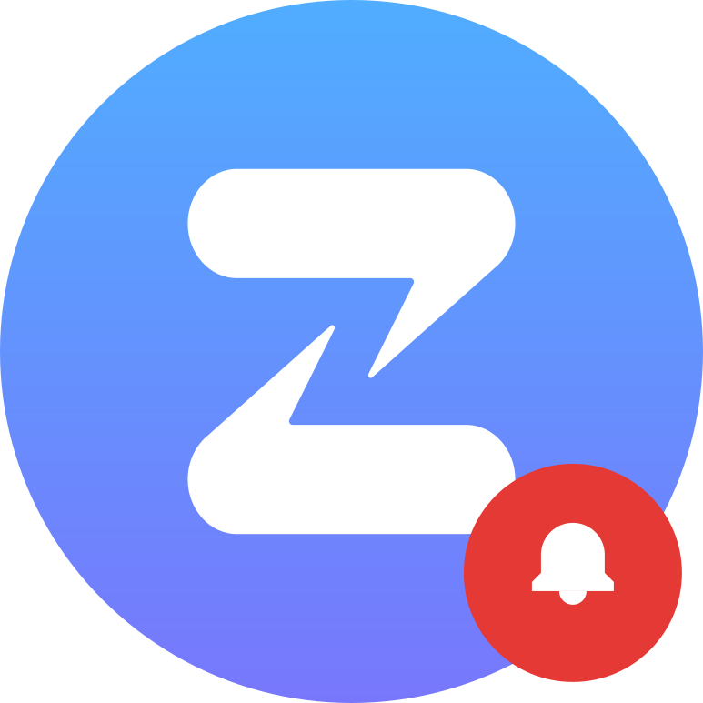

# zulip-notifications

<p align="center">
  
</p>

get browser/mobile notifications for zulip messages when the official app doesn't deliver them.

> **note:** unofficial project, not affiliated with zulip.

## features

- real-time notifications via zulip's event queue api (instant, not polling)
- notifies on PMs and @-mentions
- android app with background service
- web app (keep tab open)
- credentials stored locally

## usage

### android

download the apk from releases and install it. enter your zulip server url, email, and api key (found in zulip settings → account & privacy → api key).

### web

open the hosted version or run locally:

```sh
pnpm install
pnpm dev
```

## build android apk

```sh
pnpm build
npx cap sync android
cd android && ./gradlew assembleDebug
```

apk will be at `android/app/build/outputs/apk/debug/app-debug.apk`

## roadmap

- [ ] cloudflare worker for true web push (tab closed)
- [ ] notification filtering options
- [ ] ios support maybe
- [ ] stream notification settings

## license

MIT
