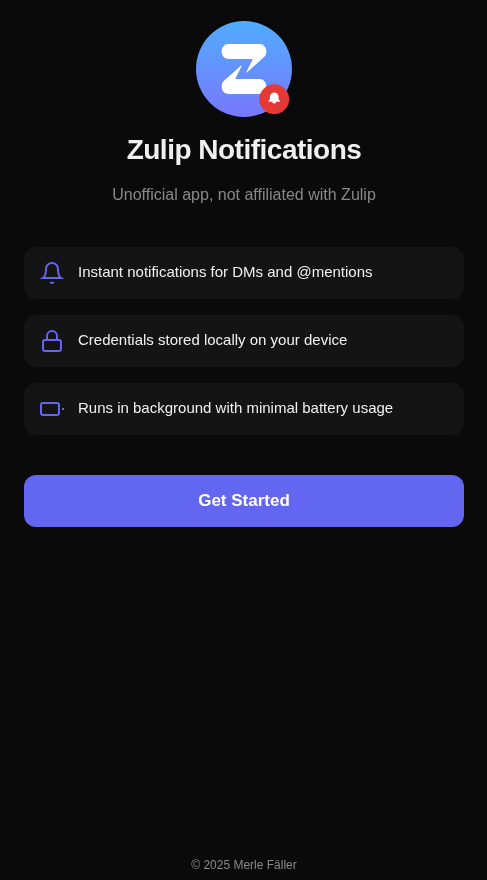
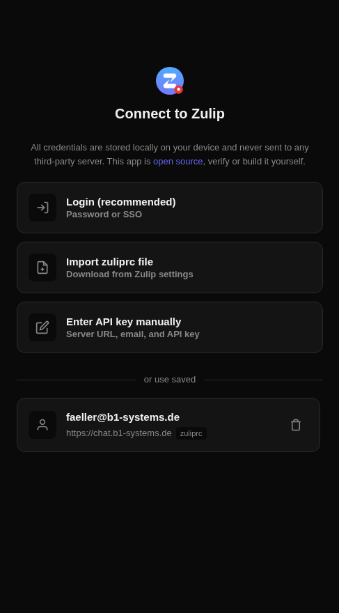
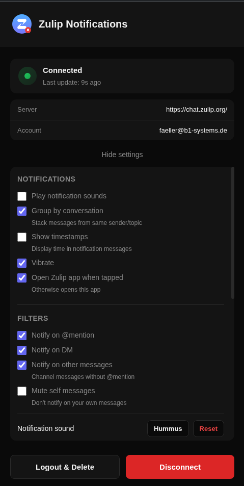

# zulip-notifications

<p align="center">
  
</p>

get instant notifications for zulip messages when the official app doesn't deliver them reliably.

> **note:** unofficial project, not affiliated with zulip.

## features

- real-time notifications via zulip's event queue api (instant, no polling)
- notifies on DMs and @-mentions
- multi-account support with quick swtching
- notification filters (mute channels, topics, quiet hours)
- custom notification sounds
- supports password, SSO, zuliprc, and manual api key auth
- android foreground service for reliable background delivery
- web app (keep tab open)
- credentials stored locally only
- optional public stats (can be disabled in settings) - [view them here](https://stats.faeller.me)

## screenshots

<p align="center">
  
  
  
</p>


## install

### android

download the apk from [releases](https://github.com/faeller/zulip-mobile-notifs/releases) or get it form f-droid (coming soon).

### web

open the [hosted version](https://faeller.github.io/zulip-mobile-notifs/) or run locally:

```sh
pnpm install
pnpm dev
```

## build

```sh
pnpm build
npx cap sync android
cd android && ./gradlew assembleDebug
```

apk at `android/app/build/outputs/apk/debug/app-debug.apk`

## roadmap

- [x] notification filtering options
- [x] multi-account support
- [x] custom sounds
- [x] quiet hours
- [ ] f-droid release
- [ ] cloudflare worker for true web push
- [ ] ios support maybe

## license

GPL-3.0
